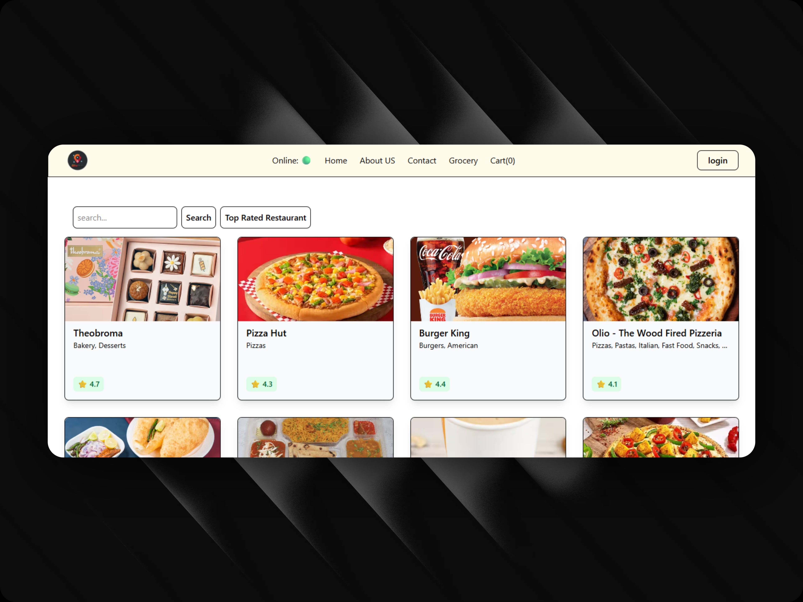
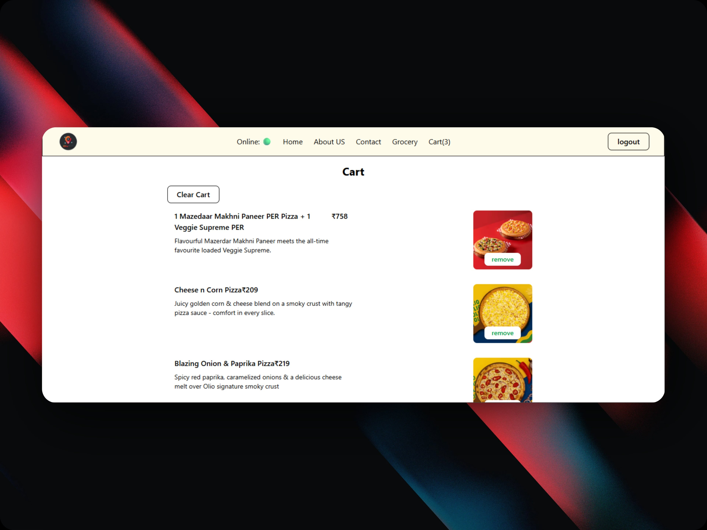

# Restaurant Ordering App

A React-based restaurant ordering application that allows users to discover restaurants, browse menus, and manage their cart using live restaurant data.

## Features

- Browse restaurants
- Search restaurants by name
- Filter top-rated restaurants
- View restaurant menus
- Add items to cart
- Remove items from cart
- Client-side routing
- Global state management using Redux Toolkit
- Shimmer loading UI
- Live API integration

## Screenshots

### Restaurant Menu


### Cart


## Tech Stack

- React
- React Router DOM
- Redux Toolkit
- JavaScript (ES6+)
- CSS
- Parcel

## Project Structure

```text
src/
├── components/
├── utils/
├── assets/
├── App.js
└── index.css
```

## Installation

1. Clone the repository

```bash
git clone https://github.com/your-username/restaurant-ordering-app.git
```

2. Install dependencies

```bash
npm install
```

3. Start the development server

```bash
npm start
```

## Learning Outcomes

This project was built while learning React and helped me understand:

- JSX and Functional Components
- Props and State Management
- React Hooks (`useState`, `useEffect`)
- React Router
- Context API
- Redux Toolkit
- API Fetching
- Component Composition
- Lifting State Up
- Props Drilling
- Conditional Rendering
- Performance Optimizations

## Future Improvements

- User authentication
- Responsive mobile design improvements
- Checkout flow
- Order placement functionality
- Favorites/Wishlist feature
- Better error handling

## Live Demo

Coming Soon

## Author

Built by Abu Sufiyan while learning and practicing React.